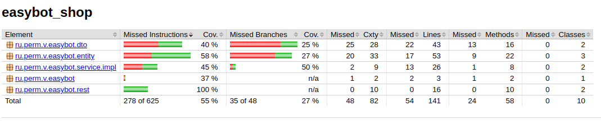

### Тестовое задание

#### Java и Spring Boot
<b>Цель:</b> Cоздать небольшое приложение на базе Spring Boot.<br/>
Задание:
Магазин, торгующий компьютерами и комплектующими со следующим типом товаров:
<ul>
<li>Настольные компьютеры</li>
<li>Ноутбуки</li>
<li>Мониторы</li>
<li>Жесткие диски</li>
</ul>
Каждый товар имеет следующие свойства:
<ul>
<li>номер серии</li>
<li>производитель</li>
<li>цена</li>
<li>количество единиц продукции на складе</li>
</ul>

Дополнительные свойства:
<ul>
<li>Настольные компьютеры имеют форм-фактор: десктопы, неттопы, моноблоки</li>
<li>Ноутбуки подразделяются по размеру: 13, 14, 15, 17 дюймовые</li>
<li>Мониторы имеют диагональ</li>
<li>Жесткие диски имеют объем</li>
</ul>
   Необходимо реализовать back-end приложение, которое имеет RESTful HTTP методы
   выполняющие:
<ul>
<li>Добавление товара</li>
<li>Редактирование товара</li>
<li>Просмотр всех существующих товаров по типу</li>
<li>Просмотр товара по идентификатору</li>
</ul>
В качестве базы данных использовать in memory database, например H2. Для проверки результата, присылайте ссылку на репозиторий на GitHub, в котором размещен код проекта. В README.md файле репозитория должна быть подробная инструкция по запуску приложения.

### Покрытие тестами

Использован jacoco. Отчет генерируется автоматически при сборке (mvn package) и результаты будут в папке
[target/site/jacoco/index.html](./target/site/jacoco/index.html)



### Ручное тестирование

Используется утилита httpie

```shell
>http GET :8780/api/product/31

HTTP/1.1 200 
Connection: keep-alive
Content-Type: application/json

{
    "groupProductId": 3,
    "id": 31,
    "name": "Desktop1"
}

```

### TODO

Провести behave тестирование с помощью RestAssured


