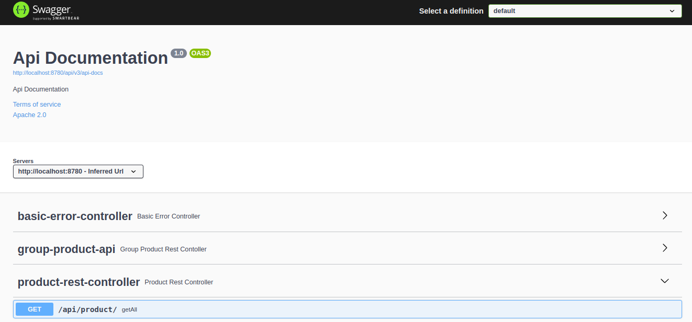
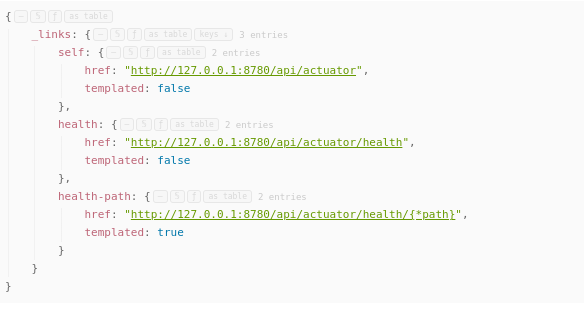

### Тестовое задание

#### Java и Spring Boot
<b>Цель:</b> Cоздать небольшое приложение на базе Spring Boot.<br/>
Задание:
Магазин, торгующий компьютерами и комплектующими со следующим типом товаров:
<ul>
<li>Настольные компьютеры</li>
<li>Ноутбуки</li>
<li>Мониторы</li>
<li>Жесткие диски</li>
</ul>
Каждый товар имеет следующие свойства:
<ul>
<li>номер серии</li>
<li>производитель</li>
<li>цена</li>
<li>количество единиц продукции на складе</li>
</ul>

Дополнительные свойства:
<ul>
<li>Настольные компьютеры имеют форм-фактор: десктопы, неттопы, моноблоки</li>
<li>Ноутбуки подразделяются по размеру: 13, 14, 15, 17 дюймовые</li>
<li>Мониторы имеют диагональ</li>
<li>Жесткие диски имеют объем</li>
</ul>
   Необходимо реализовать back-end приложение, которое имеет RESTful HTTP методы
   выполняющие:
<ul>
<li>Добавление товара</li>
<li>Редактирование товара</li>
<li>Просмотр всех существующих товаров по типу</li>
<li>Просмотр товара по идентификатору</li>
</ul>
В качестве базы данных использовать in memory database, например H2. Для проверки результата, присылайте ссылку на репозиторий на GitHub, в котором размещен код проекта. В README.md файле репозитория должна быть подробная инструкция по запуску приложения.

### Покрытие тестами

Использован jacoco. Отчет генерируется автоматически при сборке (mvn package) и результаты будут в папке
[target/site/jacoco/index.html](./target/site/jacoco/index.html)


### Ручное тестирование

Используется утилита httpie

```shell
>http GET :8780/api/product/31

HTTP/1.1 200 
Connection: keep-alive
Content-Type: application/json

{
    "groupProductId": 3,
    "id": 31,
    "name": "Desktop1"
}

```

### Swagger

Доступен по адресу http://localhost:8780/api/swagger-ui/index.html



### Actuator

Доступен по адресу http://127.0.0.1:8780/api/actuator/



### Создание Docker

```shell
# create docker image
$./docker_build.sh

# run app
$ docker run -p 8080:8780 myorg/myapp

$ docker ps
CONTAINER ID   IMAGE         COMMAND                CREATED              STATUS              PORTS                                     NAMES
1f472b2bea9e   myorg/myapp   "java -jar /app.jar"   About a minute ago   Up About a minute   0.0.0.0:8080->8080/tcp, :::8080->8080/tcp zen_shaw

# test
$ http GET 127.0.0.1:8080/api/product/31

HTTP/1.1 200
Connection: keep-alive
Content-Type: application/json
Date: Thu, 08 Jun 2023 13:20:25 GMT
Keep-Alive: timeout=60
Transfer-Encoding: chunked

{
"groupProductId": 3,
"id": 31,
"name": "Desktop1"
}

$docker stop 1f4
````

### TODO

Провести behave тестирование с помощью RestAssured<br/> 


